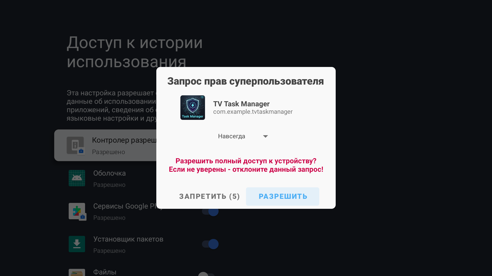
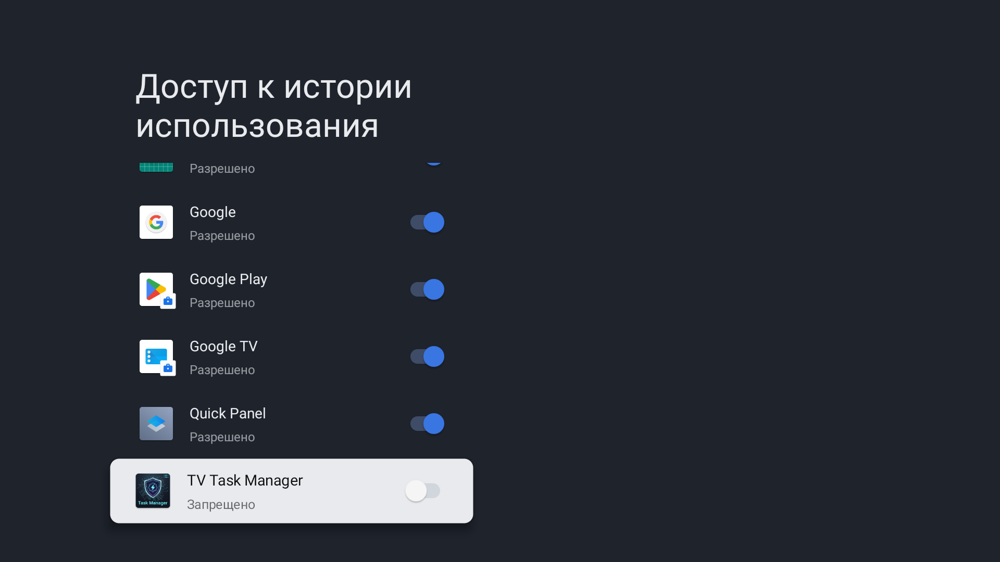
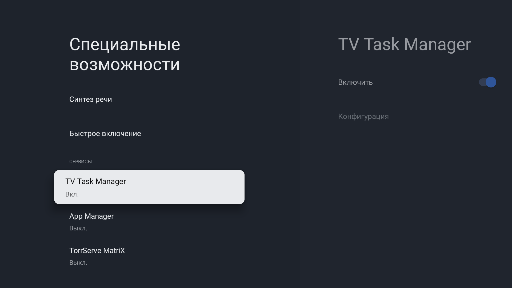
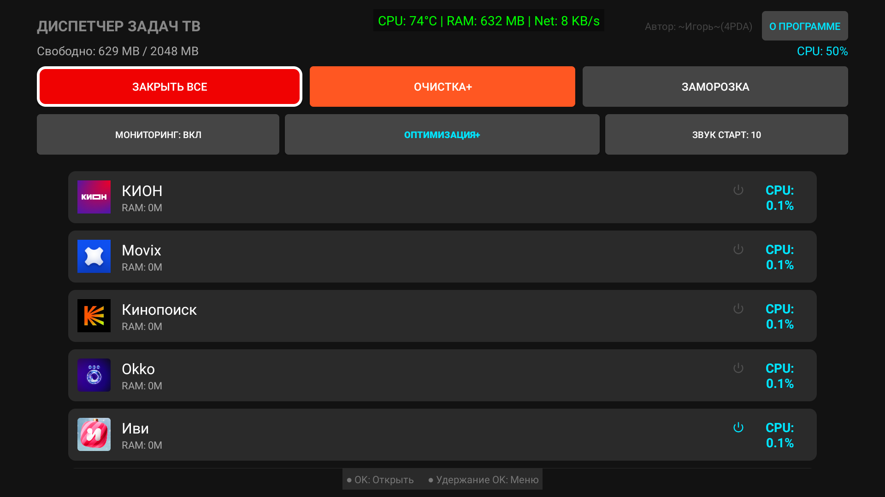

# TV-Task-Manager-Root
Advanced Root Task Manager and System Optimizer for Android TV (TCL specialized).

Эффективный менеджер задач и системный оптимизатор для Android TV. Инструмент позволяет полностью контролировать фоновую активность приложений, очищать системный мусор и управлять автозагрузкой с использованием прав SuperUser.

## 🚀 Основные возможности
* **Force Kill & Block:** Остановка приложений с автоматической блокировкой их невидимого перезапуска (через AppOps).
* **Контроль автозапуска:** Отключение широковещательных приемников (BOOT_COMPLETED) для ускорения загрузки системы.
* **Глубокая оптимизация:** Удаление дампов и логов TCL, очистка кэша и выполнение `fstrim`.
* **Заморозка пакетов:** Временная деактивация ненужных системных и партнерских приложений (скрытие из лаунчера).
* **Smart Whitelist:** Автоматическая защита Magisk, системных сервисов и инструментов автоматизации.

## 🛠 Требования
* Android TV 9.0+
* Наличие Root-прав (Magisk)

---

## 🆕 Что нового в v2.0-stable
* **Стабильность:** Исправлены критические ошибки (NullPointerException) при работе с уведомлениями в фоновых потоках.
* **Механизм блокировки:** Внедрена защита через AppOps, предотвращающая скрытый самозапуск приложений после их принудительной остановки.
* **Чистка системы:** Добавлен алгоритм удаления мусорных логов TCL и системных дампов для освобождения места в `/data`.
* **Интеллект:** Автоматическое определение и подавление «наглых» процессов, восстанавливающих свой автозапуск.
* **UI:** Текст системных отчетов стал более строгим и технически информативным.

  
  
  
  

